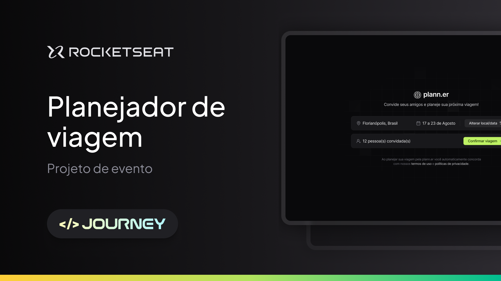

<h1 align="center">
  
  NLW Journey (Node)
</h1>

<p align="center">
  

  

  
  
  <a href="https://github.com/pabloxt14/nlw-journey-node/commits/master">
    
  </a>
    
   

   <a href="https://github.com/pabloxt14/nlw-journey-node/stargazers">
    
  </a>
</p>

<p>
  
</p>

<h4 align="center"> 
	🚀 Aplicação finalizada 🚀
</h4>

<p align="center">
 <a href="#-about">About</a> | 
 <a href="#-routes">Routes</a> | 
 <a href="#-setup">Setup</a> | 
 <a href="#-technologies">Technologies</a> | 
 <a href="#-license">License</a>
</p>


## 💻 About

Esta é a API da aplicação de nome **Plann.er**, a qual consiste em um sistema de planejamento de viagens, na qual você pode montar planos de viagens com amigos, registrar atividades, adicionar links úteis sobre a viagem, entre diversas outras funcionalidades.

Essa aplicação foi desenvolvida durante o evento **NLW Journey** da [Rocketseat](https://www.rocketseat.com.br/) utilizando principalmente tecnologias como `Node`, `TypeScript` e `Fastify`.


<!-- ## 🔗 Deploy

O deploy da aplicação pode ser acessada através da seguinte URL base: https://pabloxt14-nlw-expert-notes.vercel.app/ -->


## ⛕ Routes

### Trips Routes

#### POST `/trips`

Cria uma nova viagem.

##### Request body

```json
{
  "destination": "São Paulo",
  "starts_at": "2024-08-01 18:00:00",
  "ends_at": "2024-08-04 18:00:0",
  "owner_name": "John Doe",
  "owner_email": "johndoe@gmail.com",
  "emails_to_invite": [
    "pedrodoe@gmail.com",
    "marydoe@gmail.com",
    "sarahdoe@gmail.com"
  ]
}
```

##### Response body

```json
{
  "tripId": "f944daf7-e7e6-47a2-b050-1556d6a9e963"
}
```

#### GET `/trips/:tripId`

Retorna os detalhes de uma viagem.

##### Response body

```json
{
  "trip": {
    "id": "f944daf7-e7e6-47a2-b050-1556d6a9e963",
    "destination": "Rio de Janeiro",
    "starts_at": "2024-08-01T21:00:00.000Z",
    "ends_at": "2024-08-04T21:00:00.000Z",
    "is_confirmed": true
  }
}
```

#### PUT `/trips/:tripId`

Altera uma viagem.

##### Request body

```json
{
  "destination": "Rio de Janeiro",
  "starts_at": "2024-08-01 18:00:00",
  "ends_at": "2024-08-04 18:00:0"
}
```

##### Response body

```json
{
  "tripId": "f944daf7-e7e6-47a2-b050-1556d6a9e963"
}
```


#### GET `/trips/:tripId/confirm`

Confirma uma viagem.

### Participants Routes

#### POST `/trips/:tripId/invites`

Envia um convite a um participante para uma viagem.

##### Request body

```json
{
  "email": "johndoe3@gmail.com"
}
```

##### Response body

```json
{
  "participantId": "f944daf7-e7e6-47a2-b050-1556d6a9e963"
}
```

#### GET `/trips/:tripId/participants`

Retorna os participantes de uma viagem.

##### Response body

```json
{
  "participants": [
    {
      "id": "a91c91e1-8cca-4649-88e8-91cdf143df22",
      "name": "John Doe",
      "email": "johndoe@gmail.com",
      "is_confirmed": true
    },
    {
      "id": "dce0de32-421a-4512-9580-21c75648350d",
      "name": null,
      "email": "marydoe@gmail.com",
      "is_confirmed": false
    },
    {
      "id": "d673c4eb-f39a-4de4-8617-ef23b3707693",
      "name": null,
      "email": "pedro@gmail.com",
      "is_confirmed": true
    }
  ]
}
```

#### GET `/participants/:participantId`

Retorna os detalhes de um participante.

##### Response body

```json
{
  "participant": {
    "id": "a91c91e1-8cca-4649-88e8-91cdf143df22",
    "name": "John Doe",
    "email": "johndoe@gmail.com",
    "is_confirmed": true
  }
}
```

#### GET `/participants/:participantId/confirm`

Confirma um participante na viagem.

### Activities Routes

#### POST `/trips/:tripId/activities`

Cria uma atividade em uma viagem.

##### Request body

```json
{
  "title": "Play",
  "occurs_at": "2024-08-01 18:00:00"
}
```

##### Response body

```json
{
  "activityId": "f944daf7-e7e6-47a2-b050-1556d6a9e963"
}
```

#### GET `/trips/:tripId/activities`

Retorna as atividades de uma viagem.

##### Response body

```json
{
  "activities": [
    {
      "date": "2024-08-01T21:00:00.000Z",
      "activities": [
        {
          "id": "6e444c9e-11b8-4b95-b5ff-73288f3c0b5e",
          "title": "Play",
          "occurs_at": "2024-08-01T22:00:00.000Z",
          "trip_id": "f944daf7-e7e6-47a2-b050-1556d6a9e963"
        }
      ]
    },
    {
      "date": "2024-08-02T21:00:00.000Z",
      "activities": [
        {
          "id": "6e444c9e-11b8-4b95-b5ff-73288f3c0b5e",
          "title": "Play",
          "occurs_at": "2024-08-02T22:00:00.000Z",
          "trip_id": "f944daf7-e7e6-47a2-b050-1556d6a9e963"
        }
      ]
    }
  ]
}
```

### Links Routes

#### POST `/trips/:tripId/links`

Cria um link em uma viagem.

##### Request body

```json
{
  "title": "Website",
  "url": "https://www.rocketseat.com.br"
}
```

##### Response body

```json
{
  "linkId": "f944daf7-e7e6-47a2-b050-1556d6a9e963"
}
```

#### GET `/trips/:tripId/links`

Retorna os links de uma viagem.

##### Response body

```json
{
  "links": [
    {
      "id": "f944daf7-e7e6-47a2-b050-1556d6a9e963",
      "title": "Website",
      "url": "https://www.rocketseat.com.br",
      "trip_id": "f944daf7-e7e6-47a2-b050-1556d6a9e963"
    },
    {
      "id": "f944daf7-e7e6-47a2-b050-1556d6a9e963",
      "title": "Website 2",
      "url": "https://www.rocketseat2.com.br",
      "trip_id": "f944daf7-e7e6-47a2-b050-1556d6a9e963"
    }
  ]
}
```

## ⚙ Setup

### 📝 Requisites

Antes de baixar o projeto você vai precisar ter instalado na sua máquina as seguintes ferramentas:

* [Git](https://git-scm.com)
* [NodeJS](https://nodejs.org/en/)
* [NPM](https://www.npmjs.com/), [PNPM](https://pnpm.io/pt/) ou [Yarn](https://yarnpkg.com/) 

Além disto é bom ter um editor para trabalhar com o código como [VSCode](https://code.visualstudio.com/)

Para testar as rotas da aplicação você pode usar o cliente HTTP [Postman](https://www.postman.com/)

### Cloning and Running

Passo a passo para clonar e executar a aplicação na sua máquina:

```bash
# Clone este repositório
$ git clone git@github.com:pabloxt14/nlw-journey-node.git

# Acesse a pasta do projeto no terminal
$ cd nlw-journey-node

# Instale as dependências
$ npm install

# Crie o arquivo '.env' e preencha as variáveis conforme o arquivo '.env.example' 

# Execute as migrations para criar as tabelas necessários no banco
$ npx prisma migrate-dev

# Execute a aplicação em modo de desenvolvimento
$ npm run dev

# A aplicação inciará na porta que você configurou no arquivo '.env' 
```


## 🛠 Technologies

As seguintes principais ferramentas foram usadas na construção do projeto:

- **[TypeScript](https://www.typescriptlang.org/)**
- **[Fastify](https://fastify.dev/)**
- **[Prisma](https://www.prisma.io/)**
- **[Zod](https://zod.dev/)**
- **[Nodemailer](https://nodemailer.com/)**
- **[DayJS](https://day.js.org/)**

> Para mais detalhes das dependências gerais da aplicação veja o arquivo [package.json](./package.json)


## 📝 License

Este projeto está sob a licença MIT. Consulte o arquivo [LICENSE](./LICENSE) para mais informações

<p align="center">
  Feito com 💜 por Pablo Alan 👋🏽 <a href="https://www.linkedin.com/in/pabloalan/" target="_blank">Entre em contato!</a>  
</p>
